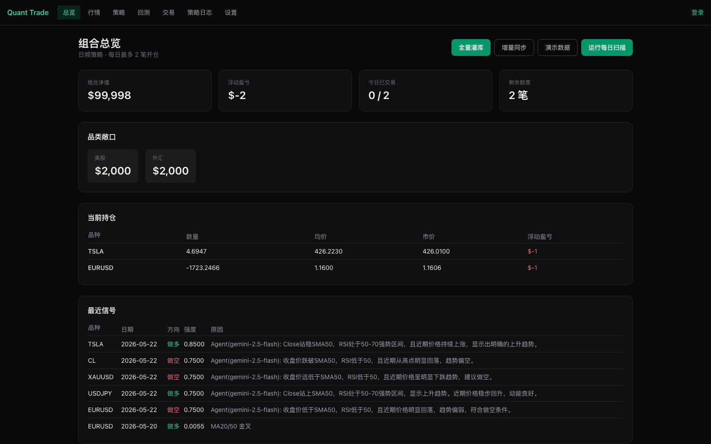
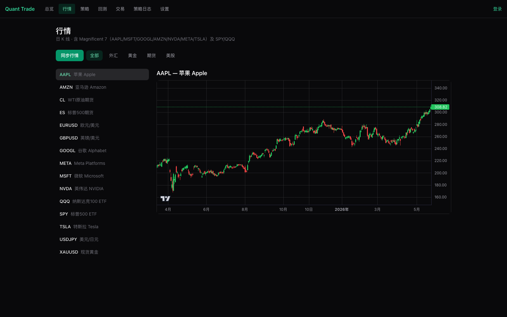
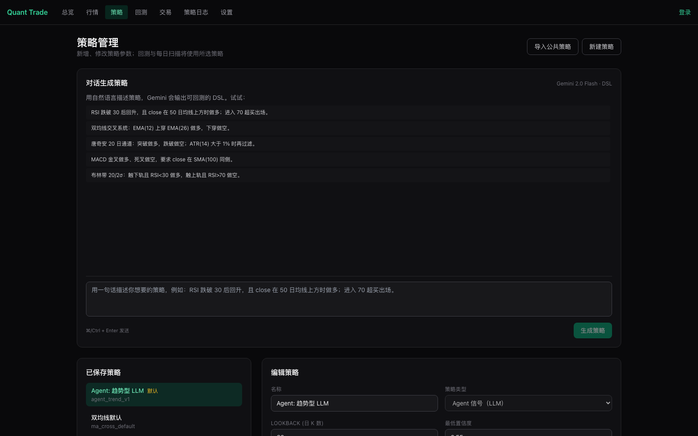
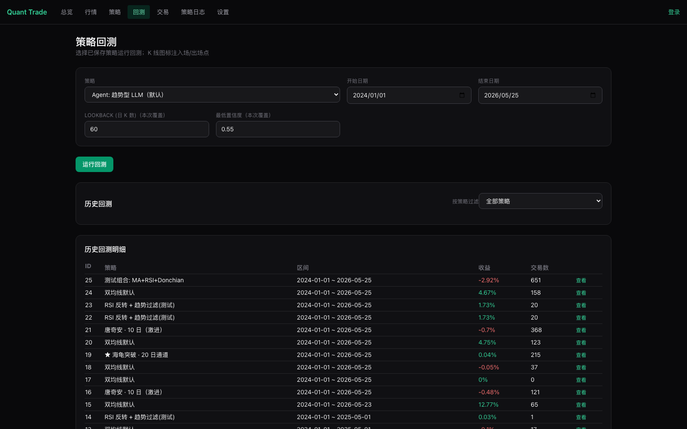
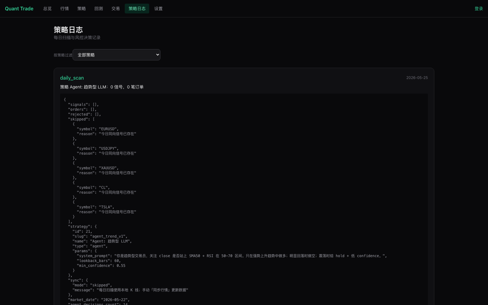

# Quant Trade · 日频多品类量化交易

[](https://github.com/MRWANG995/quant-trade/actions/workflows/ci.yml)
[](LICENSE)
[](https://www.python.org/)
[](https://nextjs.org/)

面向国际市场（外汇、黄金、期货、美股）的日频量化交易系统：每日 1–2 笔开仓，含真实数据回测、模拟盘交易、LLM 对话生成策略、组合策略、Agent 信号策略。



## ✨ 核心特性

### 📊 真实行情，零额外配置
- **15 个品种**：EURUSD / GBPUSD / USDJPY / XAUUSD / ES / CL / AAPL / MSFT / GOOGL / AMZN / NVDA / META / TSLA / SPY / QQQ
- **多源 fallback**：Stooq（主）→ Alpha Vantage → Frankfurter ECB（外汇兜底）→ Yahoo Finance
- 一个免费的 Stooq Key 即可拉满 ~3 年日 K（约 11,000 根 bar）

### 🧠 17+ 内置策略 + 三种扩展模式
**经典技术策略**
- 双均线交叉 · RSI 超买超卖 · MACD · 布林带均值回归
- 唐奇安通道（海龟） · MACD 趋势过滤 · 动量趋势

**LLM 对话生成策略（DSL）** — 用一句中文描述，Gemini 2.5 直接生成可回测的 JSON DSL：
> *"RSI 跌破 30 后回升做多，进入 70 超买出场"*
> → `{op: crosses_above, indicator: rsi(14), const: 30}` ...

**组合策略（Composite）** — 多个子策略加权聚合：
- 加权聚合：每个子策略一个权重，输出加权净分大于 0 做多、小于 0 做空
- 例：MA 50% + RSI 30% + Donchian 20%

**Agent LLM 策略** — 每日扫描时调 Gemini 分析 K 线 + 指标，按 (策略, 标的, 日期) 缓存决策：
- 你写一句系统提示词（"你是趋势型交易员…"）
- Gemini 看 60 根 K 线 + RSI/SMA/EMA/ATR + 通道指标 → 输出 `{side, confidence, reason}`
- 同一天重复扫描走 DB 缓存，不重复消耗 LLM 配额

### 📈 完整的回测引擎
- Equity / Drawdown / 月收益热力图 / 标的拆解
- 指标：Sharpe / Sortino / Calmar / 最大回撤 / 最长水下天数 / 胜率 / 盈亏比 / 平均持仓天数
- 无风险利率自动从 FRED 拉取，落库

### 🎯 模拟盘交易
- 每日扫描 → 选 Top-K 信号 → 风控（每日上限、单标的限频）→ 下单
- 模拟盘按下一交易日开盘价成交，含可配置滑点和手续费
- IB / OANDA 适配器骨架已就绪，待补全可上实盘

### 🔍 策略级过滤
- 回测历史 / 委托记录 / 扫描日志 三个页面顶部都有"按策略过滤"下拉
- URL 持久化（`?strategy_id=X`），方便对比同一策略多次跑的结果

---

## 📸 截图

### 行情 K 线（含 Magnificent 7 + ETF + 外汇 + 黄金 + 期货）


### 策略管理 + Gemini 对话生成


### 回测：完整指标 + 资金曲线 + 月度热力图


### 每日扫描日志（每条都能看到完整 JSON 决策）


---

## 🚀 快速开始

### 1. 拉代码 + 复制配置

```bash
git clone https://github.com/MRWANG995/quant-trade.git
cd quant-trade
cp backend/.env.example backend/.env
```

### 2. 拿一个免费 Stooq API Key（30 秒）

打开 https://stooq.com/q/d/?s=eurusd&get_apikey → 输验证码 → 从底部下载链接的 URL 里复制 `apikey=` 后那串。

填进 `backend/.env`：
```
STOOQ_API_KEY=<你的 key>
```

### 3. （可选）拿一个 Gemini API Key

- 用 LLM 生成 DSL 策略或 Agent LLM 策略时需要
- 免费档 1500 次/天，足够个人使用
- https://aistudio.google.com/apikey → Create API key
- 填进 `backend/.env`：`GEMINI_API_KEY=<key>`

### 4. 启动后端

```bash
cd backend
pip install -r requirements.txt
PYTHONPATH=. alembic upgrade head
PYTHONPATH=. uvicorn app.main:app --reload --port 9999
```

### 5. 启动前端

```bash
cd frontend
npm install
npm run dev
```

打开 http://localhost:9998

### 6. 灌库（首次必做）

进系统后点「全量灌库」，会从 Stooq 拉 15 个品种 ~3 年日 K，约 30 秒。

---

## 🐳 Docker 部署

```bash
cp backend/.env.example backend/.env
# 编辑 backend/.env：填入 STOOQ_API_KEY、GEMINI_API_KEY、SECRET_KEY、ADMIN_PASSWORD
docker compose up -d --build
```

| 服务 | 端口 | 说明 |
|------|------|------|
| 前端 | 9998 | Next.js standalone |
| 后端 API | 9999 | FastAPI |
| PostgreSQL | 5432 | 自动 alembic upgrade head |

API 文档：http://localhost:9999/docs

默认管理员：`admin@example.com` / `changeme`（请改）。

---

## 🏗️ 架构

```
┌─────────────────────────────────────────────────────────┐
│  Next.js 14 App Router (9998)                           │
│  ├─ 总览 / 行情(K线) / 策略 / 回测 / 交易 / 日志 / 设置  │
│  └─ 策略页含 Gemini 对话面板 + 组合编辑器 + Agent 编辑器 │
└──────────────────┬──────────────────────────────────────┘
                   │ REST + WebSocket
┌──────────────────▼──────────────────────────────────────┐
│  FastAPI (9999)                                         │
│  ├─ Auth (JWT) · CORS · APScheduler 每日 cron 扫描     │
│  ├─ /api/data/* 行情同步 / readiness                    │
│  ├─ /api/strategies 增删改 + types + LLM 生成 DSL       │
│  ├─ /api/backtest 完整回测 + 指标计算 + chart-data      │
│  ├─ /api/run/daily 每日扫描入口（含 Agent 决策）        │
│  └─ /api/orders /api/run-logs 含 strategy_id 过滤       │
└──────────────────┬──────────────────────────────────────┘
                   │
        ┌──────────┼──────────┐
        ▼          ▼          ▼
   ┌────────┐ ┌────────┐ ┌────────────┐
   │ Stooq  │ │Frankf. │ │ Gemini 2.5 │
   │  CSV   │ │  ECB   │ │   Flash    │
   └────────┘ └────────┘ └────────────┘
        │          │          │
        └────┬─────┘          │ JSON
             ▼                ▼
   ┌──────────────────┐  ┌────────────────────┐
   │  Bar / Position  │  │ AgentDecision 缓存 │
   │  Signal / Order  │  │ (str, inst, date)  │
   └──────────────────┘  └────────────────────┘
        SQLite / Postgres + Alembic
```

### 策略类型扩展机制

所有策略走统一 `STRATEGY_TYPE_CATALOG`，新增策略类型只需：
1. `app/strategies/<type>.py` 实现 `scan_historical_signals` / `latest_signal` / `min_bars_required` 三个函数
2. `registry.py` 在 `STRATEGY_TYPE_CATALOG` 加 label + param_schema
3. `_HANDLERS` 注册三个函数
4. （可选）在 `validate_params` 里加自定义校验

回测引擎和每日扫描自动支持新类型。

---

## 📡 常用 API

| 接口 | 说明 |
|------|------|
| `GET /api/health` | 健康检查 |
| `GET /api/data/status` | 15 个品种的 K 线就绪状态 |
| `POST /api/data/bootstrap?force=true` | 全量灌库（清空 + 重新拉真实日 K） |
| `GET /api/strategies` | 列出全部策略 |
| `POST /api/strategies/generate` | LLM 从自然语言生成 DSL |
| `POST /api/backtest` | 跑回测 |
| `POST /api/run/daily` | 触发每日扫描（含 Agent 决策） |
| `GET /api/backtests?strategy_id=N` | 历史回测（可按策略过滤） |
| `GET /api/orders?strategy_id=N` | 委托记录（同上） |
| `GET /api/run-logs?strategy_id=N` | 扫描日志（同上） |

完整文档：http://localhost:9999/docs

---

## 🗂️ 项目结构

```
quant-trade/
├── backend/
│   ├── app/
│   │   ├── api/             # FastAPI 路由
│   │   ├── auth/            # JWT + seed admin
│   │   ├── brokers/         # paper / ib / oanda 适配器
│   │   ├── data/            # 5 个 provider + sync_service + readiness
│   │   ├── engine/          # backtest / live / metrics / portfolio / risk
│   │   ├── llm/             # Gemini provider + factory
│   │   ├── models/          # SQLAlchemy entities
│   │   ├── scheduler/       # APScheduler 任务
│   │   └── strategies/      # 8 个策略实现 + DSL + composite + agent + agent_runner
│   ├── alembic/             # 6 个数据库迁移
│   └── requirements.txt
├── frontend/
│   └── src/
│       ├── app/             # Next.js App Router 页面
│       ├── components/      # CandlestickChart / DrawdownChart / EquityChart / StrategyFilter / ...
│       └── lib/             # api 客户端 / auth context
├── docker-compose.yml
├── .github/workflows/ci.yml # 后端导入 + alembic + 前端 lint + build
└── README.md
```

---

## 🛣️ Roadmap

短期：
- [ ] Agent 策略稀疏采样回测（月度采样而不是逐日，控制 LLM 调用量）
- [ ] Webhook 入信号端点 `/api/signals/inbound`（接 TradingView、个人脚本）
- [ ] 组合策略支持投票（k-of-n） / and / any 模式
- [ ] 多用户 + 每用户独立策略

中期：
- [ ] IB / OANDA 适配器完善至可实盘
- [ ] 策略表现的 A/B 对比页面
- [ ] WalkForward / Monte Carlo 验证

长期：
- [ ] 高频版本（分钟级 K 线 + 实时 WebSocket 行情）
- [ ] 策略市场（用户可发布、订阅他人的策略）

---

## ⚠️ 风险提示

本项目**仅用于学习和量化研究**：
- 历史回测**不预测未来收益**，过拟合是普遍现象
- 默认运行在模拟盘（paper broker），切实盘需自行验证适配器并承担风险
- 所有 LLM 输出不构成投资建议，最终决策由你负责
- 永远先用小资金 / 模拟盘验证

---

## 📄 License

[MIT](LICENSE) © 2026 [王晓龙 (MRWANG995)](https://github.com/MRWANG995)

Co-authored by [Claude Opus 4.7](https://www.anthropic.com/claude/opus).
